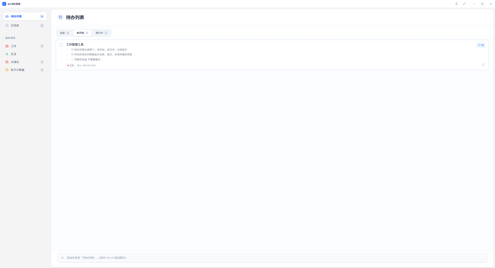

# lizl 待办管理

一款基于 **Tauri 2 + Vue 3 + Rust + SQLite** 的桌面待办事项管理应用，支持项目管理、任务优先级、富文本笔记、桌面小窗等功能。



## 功能特性

### 任务管理
- **待办列表**：聚合显示所有项目的未完成任务，卡片上标注所属项目
- **状态页签**：顶部「全部 / 未开始 / 进行中」页签快速切换，各带任务计数
- **优先级**：折叠态点击旗帜即可循环切换（无/低/中/高），卡片边框颜色随优先级变化（高=红、中=橙、低=蓝）
- **右键菜单**：标记优先级、设置所属项目、删除任务
- **任务详情**：点击卡片展开，内置 Vditor 所见即所得 Markdown 编辑器（支持 Typora 风格快捷键）
- **图片附件**：卡片内 Ctrl+V 直接粘贴图片，点击可放大预览
- **时间规划**：设置任务时间与完成时间，自动计算耗时
- **删除撤销**：删除后 5 秒内可一键撤销

### 项目管理
- 新建/编辑项目时可选择 **8 种图标** 和 **7 种预设颜色**（默认蓝色）
- 侧栏项目右键菜单：编辑、删除（删除后任务自动移回收件箱）
- 侧栏实时显示各项目未完成任务数

### 窗口框架
- **无边框窗口 + 自定义标题栏**：空白处拖动窗口，双击切换最大化
- **钉在桌面**：一键置顶，状态持久化，重启后自动恢复
- **桌面小窗模式**：380×560 紧凑小窗自动置顶，「进行中 / 未开始」快速切换，显示项目、时间与优先级色条，点圆圈即可开始/暂停任务
- 保留最小化 / 最大化 / 关闭按钮

## 技术栈

| 层 | 技术 |
|---|---|
| 前端 | Vue 3 + TypeScript + Vite + Pinia + Tailwind CSS 4 + Vditor |
| 桌面端 | Tauri 2 |
| 后端 | Rust（独立 crate `todo-core`） |
| 数据库 | SQLite（rusqlite，WAL 模式） |

## 项目结构

```
├── apps/desktop/        # Vue 3 前端
│   └── src/
│       ├── components/  # 侧栏、任务卡片、列表、小窗、标题栏等
│       ├── stores/      # Pinia 状态（任务、项目、UI）
│       └── lib/         # Tauri API 封装、窗口控制
├── crates/todo-core/    # Rust 核心逻辑（模型、SQLite 存储）
├── src-tauri/           # Tauri 壳（命令、窗口配置、权限）
└── data/                # SQLite 数据文件
```

## 本地开发

```bash
# 安装依赖
pnpm install

# 启动开发模式（前端 Vite + Tauri 窗口）
pnpm tauri dev

# 仅前端构建
pnpm --dir apps/desktop build

# 打包发布
pnpm tauri build
```

> 注意：修改 `tauri.conf.json` 或 `capabilities/` 权限文件后，需要完全重启 `pnpm tauri dev` 才会生效。

## 数据存储

任务与项目数据保存在本地 SQLite 数据库（`data/tasks.db`），无任何云端依赖，离线可用。
